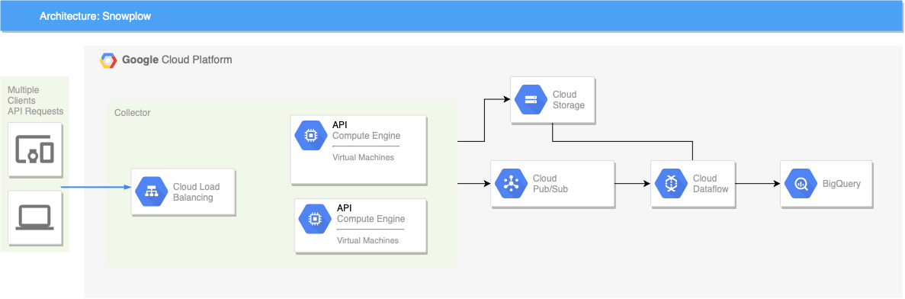

# Snowplow Google Cloud setup and configuration

This documentation guides to build Snowplow environment on Google Cloud Platform who wants to build their own analytics system.



## Prerequisites

- Google Cloud project which billing was enabled
- Google Cloud SDK

## Installation steps

### **1. Enable required services**

Browse to [https://console.cloud.google.com/apis/library](https://console.cloud.google.com/apis/library). Enable **Compute Engine API**, **Cloud Pub/Sub API** and **Dataflow API**.

### **2. Setup service account**

Browse to [https://console.cloud.google.com/apis/credentials](https://console.cloud.google.com/apis/credentials). Click **Create Credentials** and select **Service account key**. Since we enabled Compute Engine API, we can choose **Compute Engine default service account** and keep json option selected. Click create and account, file will be downloaded.

### **3. Scala Stream Collector**

We should create config file named `application.config`. [Example config file can be found here.](application.conf). With basic configurations, the only line need to edited is `googleProjectId = your-project-id`. You should change `your-project-id` with your project id which created for Snowplow. 

Now, we should fire up a GCE instance. This instance need to access just **Cloud Pub/Sub**. So, while creating this instance, we can select **Set access for each API** and enable just **Cloud Pub/Sub**. Clients need to access this instance over HTTP. We should also enable HTTP trafic for this instance. To do this, you should select **Allow HTTP Traffic** and we can set a network tag for this instance and we can set specific firewall rules if needed. With default configuration file, collector server will start serving over 8080 port. We can enable this port with using the tag that we set. 

We can keep configuration file which we created already in GC Storage service. To do this, we need to create a bucket with unique name(ex: snowplow-appscomtr-collector-bucket) and upload configuration file to this bucket. 

If previous steps are completed we can start configuring our instance to start up collector service. First, visit [https://dl.bintray.com/snowplow/snowplow-generic/](https://dl.bintray.com/snowplow/snowplow-generic/) this repo and pick latest version of stream collector for Google Pub/Sub and copy it's link. It should be named like that: `snowplow_scala_stream_collector_google_pubsub_<VERSION>.zip`. After that, Open SSH terminal to instance. Run the following commands:

```ssh
sudo apt-get update
sudo apt-get -y install default-jre
sudo apt-get -y install unzip
wget https://dl.bintray.com/snowplow/snowplow-generic/snowplow_scala_stream_collector_google_pubsub_<VERSION>.zip
gsutil cp gs://<YOUR-BUCKET-NAME>/application.conf .
unzip snowplow_scala_stream_collector_google_pubsub_<VERSION>.zip
java -jar snowplow-stream-collector-google-pubsub-<VERSION>.jar --config application.conf
```

Change `<YOUR-BUCKET-NAME>` with the name of the bucket that you created for collector and `<VERSION>` with version number that you pick from Snowplow repo. If everything is set up correctly, you should be able to make request to instance over ip address or custom domain which points to this instance. 

Instead of working with singe instance, we can user cluster of instances that will be scaled up and down automatically according to load of system. To do this, we need to create an **instance template**. You can set the same configurations for the template that we used for creating single instance. We need to set a **Startup script** for this template also. So, when new instance created, it will build and start up the collector application automatically. We can set the same commands that I mentioned above. 

To start up cluster, new **instance group** should be created with using this template with **Autoscaling** parameter is **on**. Scala collector has an health check endpoint. We can define this endpoint to this group. So, system can detect failures on instance and can start a new instance immediately. Create a **Health Check** and use this configurations:

- **Protocol**: HTTP
- **Port**: 8080
- **Request path**: /health
- **Check interval**: 10 seconds
- **Unhealthy threshold**: 3 consecutive failures

Instance group is ready to start. You can click `Create Button` and test it.

To enable automatic scale feature, we should create a **Load balancer**. With load balancer we will also have an static ip adress that we'll use when we want to set a custom domain to collector group. 

Browse to [https://console.cloud.google.com/net-services/loadbalancing/loadBalancers/list](https://console.cloud.google.com/net-services/loadbalancing/loadBalancers/list), and click **Create load balancer**. 

We should create new **backend service** while setting up load balancer in **Backend configuration**. Set **BackendType** to **Instance group** and select the instance group that we created. Set **Port numbers** field to `8080` if you didn't change the port of collector in configuration file. You can set your own default balancing mode and values but default ones are optimal and you can set health check endpoint which we defined before for **Health check** field.

Frontend part also need to be configured. To enable HTTPS for our collector, we need to set **Protocol** to **HTTPS**. Under the ip address section, to assign static ip, we should create new ip adress. Make sure **Port** field's value is set to 443. Under the **Certificate** section, create new certificate for ssl for your custom domain. After that, if everything is set up correctly, you can complete load balancer configurations. You can review and finalize the configuration. 


### **4. Configuring ETL step**

System works like that, when a client send request to collector, collector publish this log with the Google's Pub/Sub service and enricher's pull this logs from this service also. So, we need to set up some necessary pub/sub topics. Go to [https://console.cloud.google.com/cloudpubsub/topicList](https://console.cloud.google.com/cloudpubsub/topicList) this link and create these topics:

1. good
2. bad
3. bq-bad-rows
4. bq-failed-inserts
5. bq-types
6. enriched-bad
7. enriched-good

After creating this topics, **create subscriptions** that placed below for relevant topics:

1. good-sub
2. bq-types-sub
3. enriched-good-sub

Now, we should create new storage bucket to store temporary files created by the enrichment process. But we will also store some required configuration and enrichment files in this bucket too. Go to [https://console.cloud.google.com/storage/browser/](https://console.cloud.google.com/storage/browser/) and create new bucket with unique name (ex: snowplow-appscomtr-temp). Then create a folder in this bucket with name `temp-files`. We should also create `iglu_resolver.json` (you can see the [example](iglu_resolver.json)) and store it in this bucket. Be careful, we should put these files under the root path of this bucket not in `temp-files`! If we want to use some configurable enrichments, we need to also put them into this bucket. To achive this, we can create a folder named `enrichments` and put relevant enrichment files into this folder. **Note:** Some enrichments requires additional files like `ip_lookups` enrichment. This enrichment uses a db file named `GeoLite2-City.mmdb`. We should also store this file in our bucket and set file path(ex: `gs://prisma-temp-bucket/maxmind`) in relevant json file. 

It's time to create a new BigQuery dataset. After enrichment completed, events will be stored in Google's BigQuery. Go to this link: [https://console.cloud.google.com/bigquery](https://console.cloud.google.com/bigquery) and create a dataset.

We need to create a config file named `bigquery_config.json`. This scheme should be used: (Don't forget to replace relevant paths!)

```json
{
    "schema": "iglu:com.snowplowanalytics.snowplow.storage/bigquery_config/jsonschema/1-0-0",
    "data": {
        "name": "Snowplow Page View Data",
        "id": "<Random UUID>",

        "projectId": "<Your GCP project name>",
        "datasetId": "<The BigQuery dataset ID>",
        "tableId": "events",

        "input": "enriched-good-sub",
        "typesTopic": "bq-types",
        "typesSubscription": "bq-types-sub",
        "badRows": "bq-bad-rows",
        "failedInserts": "bq-failed-inserts",

        "load": {
            "mode": "STREAMING_INSERTS",
            "retry": false
        },

        "purpose": "ENRICHED_EVENTS"
    }
}
```

`<Random UUID>` should be changed with a random UUID. We can generate a UUID easily from [here](https://www.uuidgenerator.net/). If you create Pub/Sub topic with the names that we suggest, you don't need to change them. But if you created topics with different names, you also need to edit these parameters. After complete the replacings upload this file to temp bucket with the same level of `iglu_resolver.json`.

We are so close to end now. We need to create an instance to start ETL processes. To do this, we can create an instance template and create an instance from that template. Go to [https://console.cloud.google.com/compute/instanceTemplates/list](https://console.cloud.google.com/compute/instanceTemplates/list) this link and click create instance template. Make sure that you select **Compute Engine default service account** and **Set access for each API**. Then enable these services: **BigQuery**, **Cloud Pub/Sub**, **Compute Engine**(Read Write) and **Storage**(Read Write). After that expand the **Management, security, disks, networking, sole tenancy** section and under the **Automation** write this startup script: 

```ssh
#! /bin/bash
enrich_version="0.1.0"
bq_version="0.1.0"
bucket_name="<BUCKET NAME>"
project_id="<PROJECT ID>"
region="us-central1"

sudo apt-get update
sudo apt-get -y install default-jre
sudo apt-get -y install unzip

wget https://dl.bintray.com/snowplow/snowplow-generic/snowplow_beam_enrich_$enrich_version.zip
unzip snowplow_beam_enrich_$enrich_version.zip

wget https://dl.bintray.com/snowplow/snowplow-generic/snowplow_bigquery_loader_$bq_version.zip
unzip snowplow_bigquery_loader_$bq_version.zip

wget https://dl.bintray.com/snowplow/snowplow-generic/snowplow_bigquery_mutator_$bq_version.zip
unzip snowplow_bigquery_mutator_$bq_version.zip

gsutil cp gs://$bucket_name/iglu_resolver.json .
gsutil cp gs://$bucket_name/bigquery_config.json .
gsutil cp -r gs://$bucket_name/enrichments .

./beam-enrich-$enrich_version/bin/beam-enrich --runner=DataFlowRunner --project=$project_id --streaming=true --region=$region --gcpTempLocation=gs://$bucket_name/temp-files --job-name=beam-enrich --raw=projects/$project_id/subscriptions/good-sub --enriched=projects/$project_id/topics/enriched-good --bad=projects/$project_id/topics/enriched-bad --resolver=iglu_resolver.json --workerMachineType=n1-standard-1 --enrichments=enrichments

./snowplow-bigquery-mutator-$bq_version/bin/snowplow-bigquery-mutator create --config $(cat bigquery_config.json | base64 -w 0) --resolver $(cat iglu_resolver.json | base64 -w 0)

./snowplow-bigquery-mutator-$bq_version/bin/snowplow-bigquery-mutator listen --config $(cat bigquery_config.json | base64 -w 0) --resolver $(cat iglu_resolver.json | base64 -w 0) &

./snowplow-bigquery-loader-$bq_version/bin/snowplow-bigquery-loader --config=$(cat bigquery_config.json | base64 -w 0) --resolver=$(cat iglu_resolver.json | base64 -w 0) --runner=DataFlowRunner --project=$project_id --region=$region --gcpTempLocation=gs://$bucket_name/temp-files --maxNumWorkers=2 --workerMachineType=n1-standard-1
```
You need to chaange `<BUCKET NAME>` and `<PROJECT ID>` with relevant values of your project. You can also change the region. You can also change the **workerMachineType**s and **maxNumWorkers** with your values. If you don't want BigQuery loader auto scale you can also use `--autoscalingAlgorithm=NONE` parameter.

Now all ready. We can start an basic instance from this template and test the system!